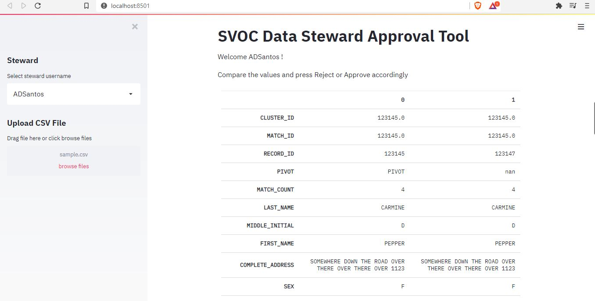
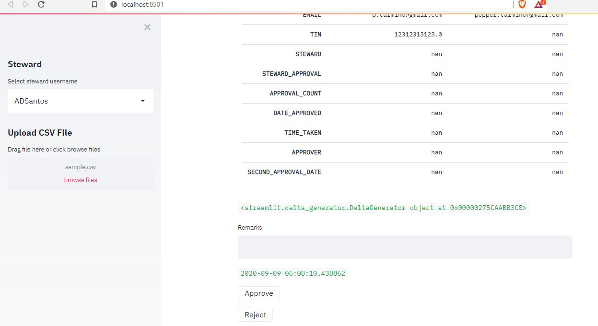

# svoc-app
Python streamlit app for SVOC approval facilitation. 

# Agenda
* ~~Create loading loop~~
* ~~Auto-tag PIVOTS & SIBLINGS as PIVOT~~
* Create timetaken function
* Create filter widget to search for clusters/records
* Create export function
    * Commit all edited rows to datatable
    * Print out datatable as CSV
* Create BAT files for setup, init

## Optional Features
* Include dupe highlighting for QOL(Easier match spotting by glance)
* Create review function for all matching records
* Create approval suggestions based on current guidelines
* Create guideline widget on sidebar
* Stylized UI, colors for approve and reject button
* Generate report: timetaken, cluster count, matched_row count; export to separate CSV or text

# UI Preview

