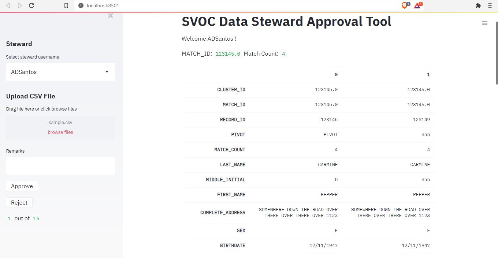

# svoc-app
Python streamlit app for SVOC approval facilitation. 

# Agenda
* Create filter widget to search for clusters/records
* Create BAT files for setup, init
* Separate rendering of view dependent on filtering or first approval.
* Optimize program by creating functions

## Optional Features
* Include dupe highlighting for QOL(Easier match spotting by glance)
* Create approval suggestions based on current guidelines
* Create guideline widget on sidebar
* Stylized UI, colors for approve and reject button
* Progress bar to ~~show rows completed out of total matched_rows~~
* Allow edits during Cluster Review

## Bugs
* Duplicate Next Button
* Remarks not clearing on next record
* Minor delay in viewing next record

# UI Preview

